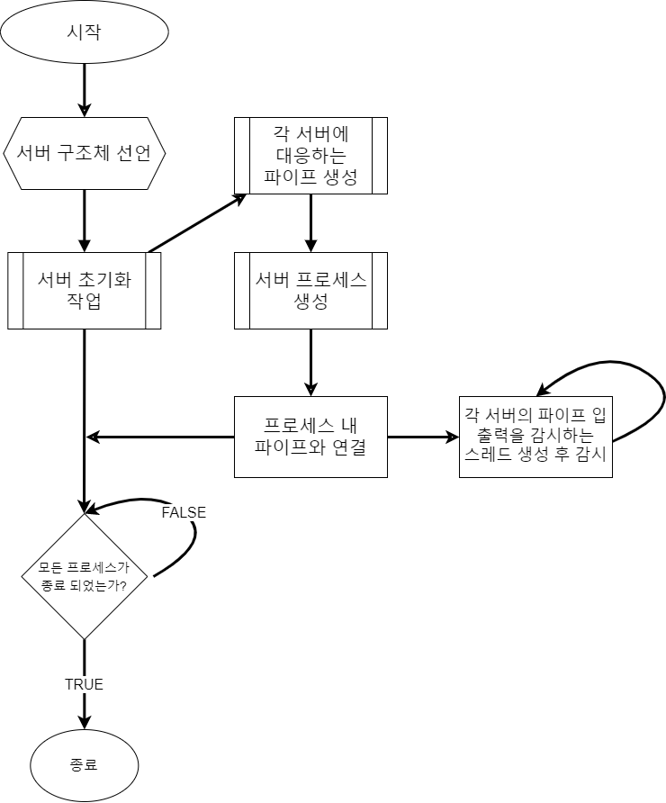

# NamedPipe

  
- NamedPipe를 이용한 IPC 구조도입니다.  
- 사용된 NamedPipe는 양방향 파이프로서 일련의 읽기, 쓰기 과정을 순차적으로 진행합니다.  
  
  

- 마스터 서버에 적용된 단순한 알고리즘입니다.  
- 사용할 서버의 프로세스를 생성하고 서버에 대응하는 파이프를 생성해 연결시킨 뒤 멀티 쓰레드 처리를 진행합니다.  
  
# References  
1. [파이프(프로세스 간 통신) - Win32 / MSDN](https://learn.microsoft.com/ko-kr/windows/win32/ipc/pipes)  
2. [NamedPipe 구현에 대해서 간단 정리](https://mhchoi8423.tistory.com/128)  
